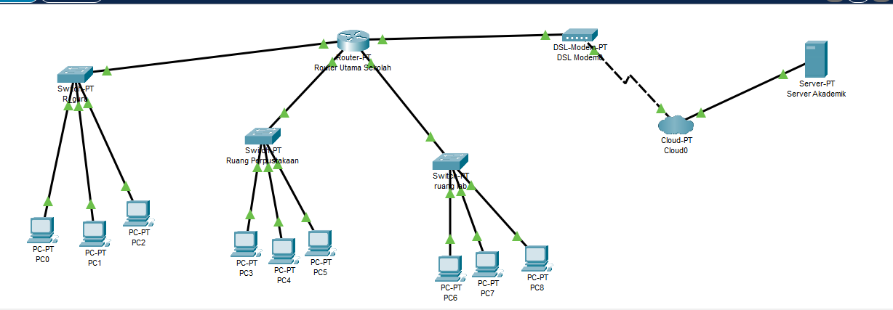
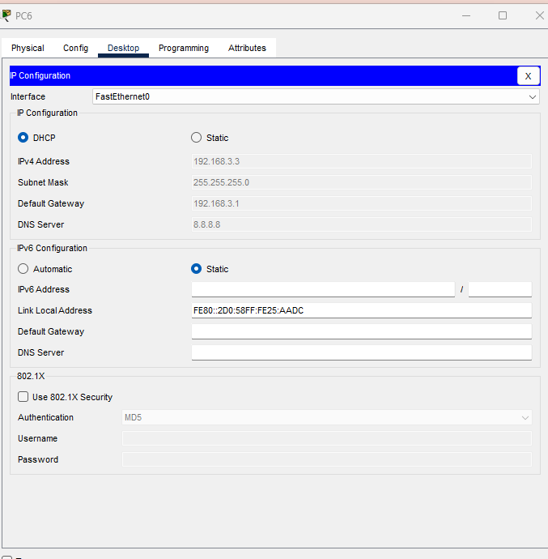
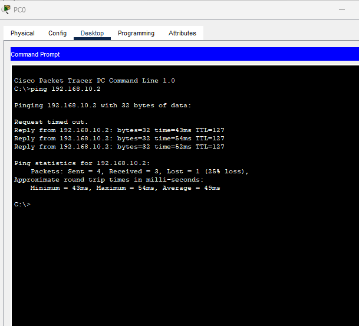
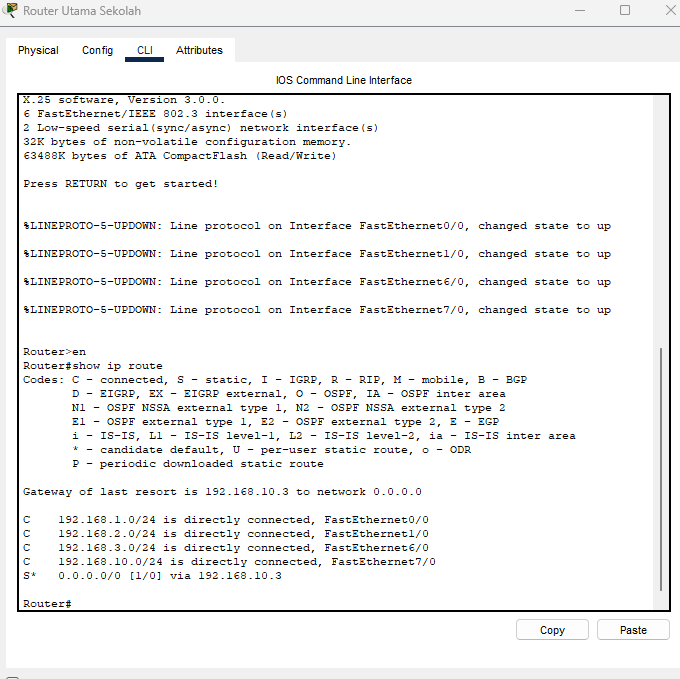

# Simulasi Infrastruktur Jaringan Sekolah (Full Connectivity)

Proyek ini adalah simulasi perancangan infrastruktur jaringan berskala institusi pendidikan yang dibangun menggunakan Cisco Packet Tracer. Fokus utama dari perancangan ini adalah memastikan **Konektivitas Penuh (Full Connectivity)** antara semua perangkat di sekolah—mulai dari Lab Siswa, Ruang Guru, hingga Server Akademik—agar kolaborasi dan pertukaran informasi dapat berjalan tanpa hambatan.

## 🏗️ Topologi Jaringan

## ⚙️ Teknologi & Protokol yang Diimplementasikan
* **Perangkat Lunak:** Cisco Packet Tracer
* **Arsitektur Jaringan:** Flat Network (Default VLAN)
* **Alokasi IP:** DHCP Server terpusat pada Router
* **Routing:** Dynamic/Static Routing untuk menjamin setiap paket data sampai ke tujuan

---

## 📋 Skenario Konfigurasi & Hasil Pengujian

### 1. Distribusi IP Otomatis (DHCP)
Router dikonfigurasi sebagai DHCP Server. Seluruh PC Siswa dan Guru mendapatkan konfigurasi IP secara otomatis. Ini sangat efisien untuk lingkungan sekolah dengan jumlah perangkat yang banyak dan dinamis.

### 2. Konektivitas Penuh (Full Connectivity Test)
Jaringan ini dirancang agar setiap perangkat dapat saling berkomunikasi. Pengujian ping dilakukan untuk memastikan setiap segmen jaringan (Siswa ke Server, Guru ke Server, Siswa ke Guru) dapat melakukan transfer data dengan sukses (*Reply*). Hal ini mendukung kemudahan akses ke materi pembelajaran maupun printer sekolah.

---

## 🚀 Cara Menjalankan Simulasi
1. Unduh (*download*) seluruh *repository* ini ke komputer lokal.
2. Buka file `.pkt` menggunakan aplikasi **Cisco Packet Tracer**.
3. Lakukan perintah `ping` dari berbagai perangkat untuk membuktikan bahwa seluruh jaringan dalam sekolah sudah terhubung sempurna.

### 3. Verifikasi Tabel Routing (Routing Table)
Sebagai bukti bahwa router berhasil mengenali semua subnet yang ada di sekolah, kami melakukan verifikasi menggunakan perintah `show ip route`. Tabel ini menunjukkan bahwa setiap jaringan (Lab, Guru, dan Server) telah terdaftar dengan benar, sehingga komunikasi antar-area dapat dipastikan berjalan lancar tanpa hambatan.

